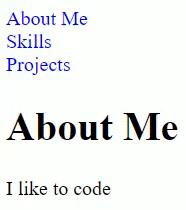

# changePage.js

Change page without reloading site



[*template.html*](https://github.com/magarenzo/change-page/blob/master/template.html) provides a template to see how [*changePage.js*](https://github.com/magarenzo/change-page/blob/master/changePage.js) works

## How it works

Use `onclick` event of `a` element to pass in `id` of `div` we want to display

```html
<a onclick="changePage(event, 'skills');">Skills</a>
```

`div` being passed to `changePage.js` needs to have `class="section"`

```html
<div id="skills" class="section"></div>
```

Sections we don't want displayed before clicking its corresponding link to show it should start with `display: none;` and we should display the first section we want showing, if any

```css
.section { display: none; }
#about { display: block; }
```

## Created with

* [JavaScript](https://www.javascript.com/)

## Owner

Michael A. Agarenzo
